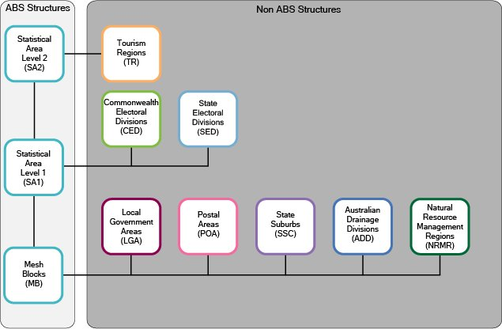
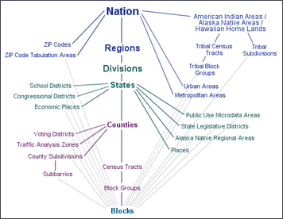

## What is the Data Observatory (DO)

> The Data Observatory, available for Enterprise accounts, provides access to a catalogue of curated datasets, and enables you to apply the results to your own datasets.
> 
> Beyond making beautiful maps, understanding sophisticated location data enables you substantiate your message based on actual metrics. To understand the fundamentals of Data Observatory, [read the guides](https://carto.com/developers/data-observatory/guides/overview/). To view the source code, browse [the open-source repository](https://github.com/CartoDB/observatory-extension) in Github. Otherwise, browse the [reference](https://carto.com/developers/data-observatory/reference/), or find different [support](https://carto.com/developers/data-observatory/support/support-options/) options.

Use the **[The Data Observatory Catalog](https://cartodb.github.io/bigmetadata/index.html)** to navigate measurements and administrative boundaries avaiable for the countries the DO currently supports:

## Australia

[Australian Bureau of Stastics](https://www.abs.gov.au/geography)
* Latest on DO is 2011
* Latest available is 2016 - ask for update

Diagram 1: ASGS ABS Structures:

Diagram 2: ASGS Non-ABS Structures:

### Main Structure

**Mesh Blocks (MBs)** are the smallest geographical area defined by the ABS. They are designed as geographic building blocks rather than as areas for the release of statistics themselves. All statistical areas in the ASGS, both ABS and Non ABS Structures, are built up from Mesh Blocks. As a result the design of Mesh Blocks takes into account many factors including administrative boundaries such as Cadastre, Suburbs and Localities and LGAs as well as land uses and dwelling distribution. Most Mesh Blocks contain 30 to 60 dwellings although some are specifically designed to have zero. This provides an additional level of confidentiality for data released on the ASGS as the difference in data released on multiple statistical areas is always at least one Mesh Block. Mesh Blocks, like other ABS structures, are stable for 5 years and are updated to reflect changes such as new housing developments every 5 years. Mesh Blocks include a Mesh Block Category that broadly defines primary land uses such as Residential and Commercial. The only statistical data currently available for Mesh Blocks (as of 2017) are total population and dwelling counts from the Census of Population and Housing.

**Statistical Areas Level 1 (SA1s)** are designed to maximise the spatial detail available for Census data. Most SA1s have a population of between 200 to 800 persons with an average population of approximately 400 persons. This is to optimise the balance between spatial detail and the ability to cross classify Census variables without the resulting counts becoming too small for use. SA1s aim to separate out areas with different geographic characteristics within Suburb and Locality boundaries. In rural areas they often combine related Locality boundaries. SA1s are aggregations of Mesh Blocks.

**Statistical Areas Level 2 (SA2s)** are designed to reflect functional areas that represent a community that interacts together socially and economically. They consider Suburb and Locality boundaries to improve the geographic coding of data to these areas and in major urban areas SA2s often reflect one or more related suburbs. The SA2 is the smallest area for the release of many ABS statistics, including the Estimated Resident Population (ERP), Health & Vitals and Building Approvals data. SA2s generally have a population range of 3,000 to 25,000 persons, and have an average population of about 10,000 persons. SA2s are aggregations of whole SA1s.

**Statistical Areas Level 3 (SA3s)** are designed for the output of regional data. SA3s create a standard framework for the analysis of ABS data at the regional level through clustering groups of SA2s that have similar regional characteristics, administrative boundaries or labour markets. SA3s generally have populations between 30,000 and 130,000 persons. They are often the functional areas of regional towns and cities with a population in excess of 20,000, or clusters of related suburbs around urban commercial and transport hubs within the major urban areas. SA3s are aggregations of whole SA2s.

**Statistical Areas Level 4 (SA4s)** are specifically designed for the output of Labour Force Survey data and reflect labour markets within each State and Territory within the population limits imposed by the Labour Force Survey sample. Most SA4s have a population above 100,000 persons to provide sufficient sample size for Labour Force estimates. In regional areas, SA4s tend to have lower populations (100,000 to 300,000). In metropolitan areas, the SA4s tend to have larger populations (300,000 to 500,000). SA4s are aggregations of whole SA3s.
State and Territory (S/T) and Australia are spatial units separately representing the geographic extent of Australia, and the States and Territories within Australia. Jervis Bay Territory, the Territories of Christmas Island, Cocos (Keeling) Islands and Norfolk Island are included as one spatial unit at the State and Territory level under the category of Other Territories. Prior to 2016 Norfolk Island was not included in the ASGS. In line with Australian Government announced reforms to the governance of Norfolk Island and its inclusion into the definition of Geographic Australia, the 2016 ASGS has been updated to include the Territory of Norfolk Island.

### Greater Capital City Statistical Area Structure

Greater Capital City Statistical Areas (GCCSAs) are designed to represent the functional extent of each of the eight State and Territory capital cities. They include the people who regularly socialise, shop or work within the city, but live in the small towns and rural areas surrounding the city. GCCSAs are not bound by a minimum population size criterion. GCCSAs are built from SA4s.

For more information on any of the Main Structure geographical areas or GCCSAs, see the Australian Statistical Geography Standard (ASGS): Volume 1 – Main Structure and Greater Capital City Statistical Areas publication.

### Significant Urban Area Structure

**Significant Urban Areas (SUAs)** represent individual Urban Centres or clusters of related Urban Centres with a core urban population over 10,000 persons. They can also include related peri-urban areas, satellite development; the area into which the urban development is likely to expand, and nearby rural land. SUAs are aggregations of SA2s which enables them to provide a broad range of regularly updated ABS demographic and social statistics that are not available for the SA1 based Urban Centres and Localities.

### Urban Centres and Localities (UCLs), Section of State Structures (SOS) and Section of State Range (SOSR) Structures

**The Urban Centres and Localities (UCLs), and Section of State (SOS)** represent areas of concentrated urban development. UCLs are defined using aggregations of SA1s which meet population density criteria or contain other urban infrastructure. The SOS classification groups the UCLs up into classes of urban areas based on population size. SOS does not explicitly define rural Australia, however in practice any population not contained in an Urban Centre or Locality is considered to be Rural Balance in the SOS classification. Section of State Range (SOSR) provides a more detailed classification than SOS. This enables statistical comparison of differently sized urban centres and the balancing ‘rural areas’. 

For more information on the SUA, UCL or SOS structures see the Australian Statistical Geography Standard (ASGS): Volume 4 – Significant Urban Areas, Urban Centres and Localities, Section of State publication.

### Remoteness Structure

Remoteness Areas (RAs) divide Australia and the States and Territories into 5 classes of remoteness on the basis of their relative access to services. RAs are based on the Accessibility and Remoteness Index of Australia (ARIA+), produced by the Hugo Centre for Migration and Population Research at the University of Adelaide. RAs are aggregates of SA1s that are grouped together based on their average ARIA+ score. 

For more information on the Remoteness Structure see the Australian Statistical Geography Standard (ASGS): Volume 5 - Remoteness Structure publication.

###Indigenous Structure
**Indigenous Locations (ILOCs)** represent small Aboriginal and Torres Strait Islander communities (urban and rural) with a minimum population of 90 Aboriginal and Torres Strait Islander usual residents. An ILOC is an area designed to allow the release of statistics relating to Aboriginal and Torres Strait Islander people with a high level of spatial accuracy whilst maintaining the confidentiality of individuals. ILOCs are aggregates of one or more SA1s.

**Indigenous Areas (IAREs)** are medium sized geographical areas designed to facilitate the release of more detailed statistics for Aboriginal and Torres Strait Islander Peoples. IAREs provide a balance between spatial resolution and population size, which provides the ability to release more detailed socio-economic attribute data than is available on ILOCs. IAREs are aggregates of one or more ILOCs.

**Indigenous Regions (IREGs)** are large geographical areas loosely based on the former Aboriginal and Torres Strait Islander Commission boundaries. The greater population of IREGs enables greater cross classification of variables when compared with IAREs and ILOCs. IREGs do not cross State or Territory borders and are aggregates of one or more IAREs.

For more information on the Indigenous Structure see the Australian Statistical Geography Standard (ASGS): Volume 2 – Indigenous Structure publication.

**NON-ABS STRUCTURES**

The Non-ABS Structures comprise eight regions which are not defined or maintained by the ABS, but for which the ABS is committed to providing a range of statistics. They generally represent administrative regions and are approximated by Mesh Blocks, SA1s or SA2s. They are: 

**Local Government Areas (LGAs)**
An ABS approximation of gazetted Local Government boundaries as defined by each State and Territory Local Government Department. These approximated boundaries are constructed from allocations of one or more whole Mesh Blocks.

**Postal Areas (POAs)**
An ABS approximation of postcodes constructed from allocations of one or more whole Mesh Blocks.

State Suburbs (SSCs)
An ABS approximation of gazetted localities constructed from the allocation of one or more whole Mesh Blocks.

**Commonwealth Electoral Divisions (CEDs)**
An ABS approximation of the Australian Electoral Commission (AEC) federal electoral division boundaries constructed from allocations of one or more whole SA1s.

**State Electoral Divisions (SEDs)**
An ABS approximation of state electoral districts using one or more SA1s.

**Australian Drainage Divisions (ADDs)**
An ABS approximation of drainage divisions provided through Australian Hydrological Geospatial Fabric, constructed from allocations of one or more whole Mesh Blocks.

**Natural Resource Management Regions (NRMRs)**
An ABS approximation of Natural Resource Management (NRM) regions defined through the Australian Governments National Landcare Programme, constructed from allocations of one or more whole Mesh Blocks.

**Tourism Regions (TRs)**
An ABS approximation of tourism regions that are provided by Tourism Research Australia, constructed from one or more whole SA2s. 

For more information on Non-ABS structures see the Australian Statistical Geography Standard (ASGS): Volume 3 – Non ABS Structures publication.

RELEASE OF THE ASGS

The regions that are defined in the ABS Structures are updated on a five yearly basis aligning with the Census of Population and Housing to provide a balance between stability and relevance to the changing underlying geography. The ABS Structures are published in Volumes 1, 2, 4 and 5 of the ASGS and the release of these is timed for use with Census data.

The Non ABS Structures are also updated in line with this five yearly Census cycle, these are published in Volume 3 of the ASGS. To accommodate the degree of change in Local Government Area (LGA) and Electoral boundaries, these are updated as required as part of Volume 3 annually in July each year. This enables ABS statistics to be released on the most up to date LGAs and Electoral Divisions.

All ASGS publications can be found on the [ABS Geography Publications](https://www.abs.gov.au/websitedbs/D3310114.nsf/home/ABS+Geography+Publications) webpage.

### Other relevent linkss

* [https://www.abs.gov.au/websitedbs/censushome.nsf/home/datapacks](https://www.abs.gov.au/websitedbs/censushome.nsf/home/datapacks)
* [https://www.abs.gov.au/websitedbs/D3310114.nsf/Home/2016%20DataPacks](https://www.abs.gov.au/websitedbs/D3310114.nsf/Home/2016%20DataPacks)
* [https://itt.abs.gov.au/itt/r.jsp?ABSMaps](https://itt.abs.gov.au/itt/r.jsp?ABSMaps)

## Brazil

* Latest on DO is 2010
* Latest available is 2016 - ask for update

https://ww2.ibge.gov.br/english/geociencias/default_prod.shtm
https://censo2010.ibge.gov.br/

Districts >> Counties >> Tracts >> Subdistricts
Run these to see the differences

## Canada

* Latest on DO is 2011
* Latest available is 2016 - ask for update

**Links:**

* [https://docs.google.com/document/d/1fbSi9IigGR_MGQjsQXw3YQfRn6T-aVn2xBI-qIPbeLw/edit](https://docs.google.com/document/d/1fbSi9IigGR_MGQjsQXw3YQfRn6T-aVn2xBI-qIPbeLw/edit)
* [https://www12.statcan.gc.ca/census-recensement/2011/geo/bound-limit/bound-limit-eng.cfm](https://www12.statcan.gc.ca/census-recensement/2011/geo/bound-limit/bound-limit-eng.cfm)

**CMA** 
A census metropolitan area (CMA) or a census agglomeration (CA) is formed by one or more adjacent municipalities centred on a population centre (known as the core). A CMA must have a total population of at least 100,000 of which 50,000 or more must live in the core based on adjusted data from the previous Census of Population Program. A CA must have a core population of at least 10,000 also based on data from the previous Census of Population Program.

To be included in the CMA or CA, other adjacent municipalities must have a high degree of integration with the core, as measured by commuting flows derived from data on place of work from the previous Census Program.

**CSD**
Census subdivision (CSD) is the general term for municipalities (as determined by provincial/territorial legislation) or areas treated as municipal equivalents for statistical purposes (e.g., Indian reserves, Indian settlements and unorganized territories). Municipal status is defined by laws in effect in each province and territory in Canada.

**CT**
Census tracts (CTs) are small, relatively stable geographic areas that usually have a population of less than 10,000 persons, based on data from the previous Census of Population Program. They are located in census metropolitan areas and in census agglomerations that had a core population of 50,000 or more in the previous census.

**DA**
A dissemination area (DA) is a small, relatively stable geographic unit composed of one or more adjacent dissemination blocks with an average population of 400 to 700 persons based on data from the previous Census of Population Program. It is the smallest standard geographic area for which all census data are disseminated. Dissemination areas cover all the territory of Canada.

**DB**
A dissemination block (DB) is an area bounded on all sides by roads and/or boundaries of standard geographic areas. The dissemination block is the smallest geographic area for which population and dwelling counts are disseminated. Dissemination blocks cover all the territory of Canada.

## European Union

**Links**

* https://eurogeographics.org/
* https://en.wikipedia.org/wiki/Nomenclature_of_Territorial_Units_for_Statistics

[NUTS Level 1](https://en.wikipedia.org/wiki/First-level_NUTS_of_the_European_Union):

[NUTS Level 2](https://en.wikipedia.org/wiki/Category:NUTS_2_statistical_regions_of_the_European_Union):

[NUTS Level 3](https://en.wikipedia.org/wiki/Category:NUTS_3_statistical_regions_of_the_European_Union):

## France

https://www.insee.fr/en/metadonnees/source/serie/s1321/

* Latest on DO is 2013
* Latest available 2015 - ask for update

**IRIS and Commune areas**

In order to prepare for the dissemination of the 1999 population census, INSEE developed a system for dividing the country into units of equal size, known as IRIS2000. In French, IRIS is an acronym of ‘aggregated units for statistical information’, and the 2000 refers to the target size of 2000 residents per basic unit.

Since that time IRIS (the term which has replaced IRIS2000) has represented the fundamental unit for dissemination of infra-municipal data. These units must respect geographic and demographic criteria and have borders which are clearly identifiable and stable in the long term.

Towns with more than 10,000 inhabitants, and a large proportion of towns with between 5,000 and 10,000 inhabitants, are divided into several IRIS units. This separation represents a division of the territory. France is composed of around 16,100 IRIS, of which 650 are in the overseas departments.

By extension, in order to cover the whole of the country, all towns not divided into IRIS units constitute IRIS units in themselves.

There are 3 types of IRIS unit:

**the residential IRIS:** population generally falls between 1,800 and 5,000. The unit is homogeneous in terms of living environment and the boundaries of the unit are based on the major dividing lines provided by the urban fabric (main roads, railways, bodies of water etc.)

**the business IRIS:** containing more than 1,000 employees, with at least twice as many employees as other residents.

**the miscellaneous IRIS units:** specific large zones which are sparsely inhabited and have a large surface area (leisure parks, ports, forests etc.).
As of January 1st 2008, 92% of IRIS units were residential, with 5% business. Since their creation, the demographic characteristics of certain IRIS units may have evolved, although their classification will not have been updated.

In 2008 a very partial reworking of the division system was undertaken to take into account major developments in the road network or demographics. This reworking was limited to around 100 IRIS units, in order to preserve continuity in the data publication series.

Division of a territory into IRIS units may be affected by modifications in the geography of the municipalities (merging of towns or villages, founding or repopulation of municipalities, land exchanges). So it is useful to specify the year of reference, for example by noting either IRIS-geography 1999 or IRIS-geography 2008.

## Mexico

* https://www.inegi.org.mx/
* http://en.www.inegi.org.mx/temas/mg/

* Latest on DO is 2015
* Latest available 2018 - ask for update

## United Kingdom

## Spain

## U.S.

> **[Core-Based Statistical Area](https://en.wikipedia.org/wiki/Core-based_statistical_area)**. 
> A core-based statistical area (CBSA) is a U.S. geographic area defined by the Office of Management and Budget (OMB) that consists of one or more counties (or equivalents) anchored by an urban center of at least 10,000 people plus adjacent counties that are socioeconomically tied to the urban center by commuting. Areas defined on the basis of these standards applied to Census 2000 data were announced by OMB in June 2003. These standards are used to replace the definitions of metropolitan areas that were defined in 1990. The OMB released new standards based on the 2010 Census on July 15, 2015.

