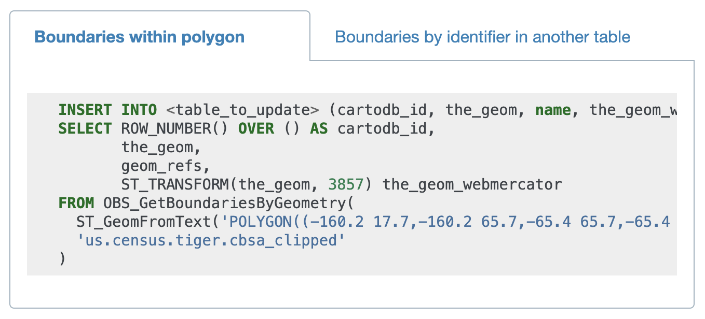

##Pre-requisites:  

1. [Builder 101](https://cartodb.github.io/pages-training/Builder_101_Hurricane_Map.html)
2. [Census 101]()
3. [Data Observatory and Builder]()

###Jump Ahead:

In your own time, follow this training in our tutorials:
[Retrieving Data Observatory Boundaries with SQL](https://carto.com/help/building-maps/retrieving-data-observatory-boundaries-with-sql/)

## Use Case: SQL API + DO - Getting Census Boundaries

### Problem to solve:
Need to get administrative census boundaries that you will later enrich with census data. 

### Desired Outcome:
Create a data layer in your CARTO account for an administrative census boundary (e.g. CBSA).

**BSA census boundaries:**
You can  download from a public source like [U.S Census Boundaries](https://www.census.gov/programs-surveys/geography/geographies/mapping-files.html), but today we are going to create the boundaries using `the Data Observatory + Builder + SQL`

### Step 1: Create an empty table in CARTO:

There are 2 options to create an empty layer in CARTO. Choose the one that best fits your style, or try both!

#### Option 1: Builder

1. From  your CARTO home dashboard click `New dataset`
2. On the next window, click `Create Empty Dataset`
3. Rename `Name` column to `geom_refs`
4. Delete `description` column

#### [Option 2: SQL API](https://carto.com/developers/sql-api/guides/creating-tables/#create-tables)
	
1. Open: [CDB Manager](https://betis.carto.io/). Read more about it [here](https://carto.com/help/working-with-data/tools/#cdb-manager)	

2. Run the following query in SQL pane or in CDB Manager:

		CREATE TABLE {table_name}
		 (
		 {column1} {data type},
		 {column2} {data type},
		 {column3} {data type}
		 )
	 
3. So your query would look like this:

		CREATE TABLE cbsa_training_sql
		 (
		 geom_refs text
		 )

While this begins the process of creating the structure for the table, it is still not visible in your dashboard. 

4. Run the `cdb_cartodbfytable` request to make the table visible.

		SELECT cdb_cartodbfytable({'username'}, {'table_name'});

The table is created and added as a connected dataset in your datasets dashboard. 

5. Refresh your browser to ensure that you can visualize it in your account. 

Once a table is connected to Your datasets dashboard in CARTO, any modifications that you apply to your data through the SQL API are automatically updated.

### Step 2: Find the census geography you want to use for the boundaries

1. Open The Data Observatory Catalog site and navigate to:

[The Data Observatory Catalog](https://cartodb.github.io/bigmetadata/index.html) >> [United States](https://cartodb.github.io/bigmetadata/united_states.html) >> [Boundaries](https://cartodb.github.io/bigmetadata/united_states/boundary.html) >> [Shoreline clipped Core Based Statistical Area (CBSA)](https://cartodb.github.io/bigmetadata/united_states/boundary/us.census.tiger.cbsa_clipped.html)

2. Copy the boundary id listed: `us.census.tiger.cbsa_clipped`

 
3. Find the bounding box of the area you want either using one of these sites:

* [http://boundingbox.klokantech.com/](http://boundingbox.klokantech.com/)[https://gist.github.com/graydon/11198540](https://gist.github.com/graydon/11198540)
* [https://anthonylouisdagostino.com/bounding-boxes-for-all-us-states/](https://anthonylouisdagostino.com/bounding-boxes-for-all-us-states/)
* [https://www.flickr.com/places/info/2459115](https://www.flickr.com/places/info/2459115)

4. Copy the bounding box, for example for North Carolina:
 
		-84.946289,33.541395,-74.926758,37.020098

5. Open the empty dataset you created in step 1 and open the SQL query panel by selecting SQL in the toggle option at the bottom left of the page:

6. Run a query in the SQL pane using all the parameters you got in steps 1-3:

	
		INSERT INTO <name of empty dataset>(the_geom, geom_refs)
		SELECT *
		FROM OBS_GetBoundariesByGeometry(
		       ST_MakeEnvelope(<bounding box>,
		                      4326'),
		       <'name of boudnary index'>)
		       

So your query should look like this for North Carolina State:
	       	
	INSERT INTO untitled_table_4(the_geom, geom_refs)
	SELECT *
	FROM OBS_GetBoundariesByGeometry(
       ST_MakeEnvelope(-84.946289,33.541395,-74.926758,37.020098,
                      4326),
       'us.census.tiger.cbsa_clipped')	

But what if you wanted to run the whole United States?

All United States:

	INSERT INTO cbsa_all(the_geom, geom_refs)
	SELECT *
	FROM OBS_GetBoundariesByGeometry(
	       ST_MakeEnvelope(-171.791110603, 18.91619, -66.96466, 71.3577635769,
	                      4326),
	       'us.census.tiger.cbsa_clipped')

       
You will get a timeout or exceeded limits error.

### Pro Tip: SQL Batch API
 
If you are comfortable with command line, read the SQL Batch API documentation here: [https://carto.com/developers/sql-api/guides/batch-queries/](https://carto.com/developers/sql-api/guides/batch-queries/).

Otherwise, we have made it easier by creating the CARTO SQL Batch API: [https://cartodb.github.io/customer_success/batch/](https://cartodb.github.io/customer_success/batch/). You can read more about it [here](https://carto.com/help/working-with-data/tools/#carto-batch-api-ui). 

See our [CARTO documentation](https://carto.com/developers/data-observatory/reference/#boundary-functions) for reference about the `OBS_GetBoundariesByGeometry` function.
 

### Step 3: Enrich the boundary with Census metrics

Find the measurement you want to enrich by:
[Total pop Per Sq kml](https://cartodb.github.io/bigmetadata/united_states/age_gender/us.census.acs.B01003001.html)

[https://carto.com/developers/data-observatory/reference/#measures-functions](https://carto.com/developers/data-observatory/reference/#measures-functions)

This function returns any Data Observatory measure that corresponds to the boundary in boundary_id that has a geometry reference of geom\_ref.

	OBS_GetMeasureById(geom_ref text, measure_id text, boundary_id text)
	
So here is the SQL Query to run:
	
	UPDATE tablename
	SET household_count = OBS_GetMeasureById(geoid_column, 'us.census.acs.B11001001', 'us.census.tiger.cbsa_clipped')

If want to run area on geom_refs:

	SELECT 
	OBS_GetMeasureById(geom_ref, 'us.census.acs.B01003001', 'us.census.tiger.cbsa',  null) / ST_Area(OBS_GetBoundaryById(geom_ref, 'us.census.acs.B01003001')::geography) area_normalized_value
	FROM your_table

###  Getting a state boundary with DO

	INSERT INTO nc_boundary(the_geom, geom_refs)
	SELECT *
	FROM OBS_GetBoundariesByGeometry(
	       ST_MakeEnvelope(-84.946289,33.541395,-74.926758,37.020098,
	                      4326),
	       'us.census.tiger.state')
	       
Get geom_ref in map for NC