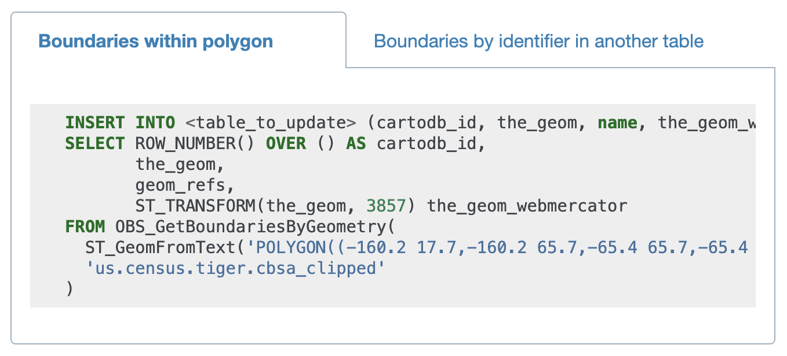
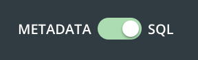

> Pre-requisite:  
> [Builder 101](https://cartodb.github.io/pages-training/Builder_101_Hurricane_Map.html)
> [Data Observatory and Builder]()

## Use Case: SQL API + DO -  Download Administrative Boundary Files

### Problem to solve:
Overlay store locations with population demographics - show average income, population density,  male vs female total population 

### Desired Outcome:
Simple choropleth of some demographic metric (aka a heatmap) with points on top of retail locations.

**BSA census boundaries:**
You can  download from a public source like [U.S Census Boundaries](https://www.census.gov/programs-surveys/geography/geographies/mapping-files.html), but today we are going to create the boundaries using `the Data Observatory + Builder + SQL`

[Retrieving Data Observatory Boundaries with SQL](https://carto.com/help/building-maps/retrieving-data-observatory-boundaries-with-sql/)

### Step 1: Create an empty table in CARTO:

#### Option 1: Builder

	- From  your CARTO home dashboard click `New dataset`
	- On the next window, click `Create Empty Dataset`
	- Rename 'Name' columng to 'geom_refs
	- Delete 'description' column

#### [Option 2: SQL API](https://carto.com/developers/sql-api/guides/creating-tables/#create-tables)
	
Open: [CDB Manager](https://betis.carto.io/). Read more about it [here](https://carto.com/help/working-with-data/tools/#cdb-manager)	

Run the following query in SQL pane or in CDB Manager:

	CREATE TABLE {table_name}
	 (
	 {column1} {data type},
	 {column2} {data type},
	 {column3} {data type}
	 )
	 
So your query would look like this:

	CREATE TABLE cbsa_training_sql
	 (
	 geom_refs text
	 )

While this begins the process of creating the structure for the table, it is still not visible in your dashboard. Run the following request to make the table visible.

	SELECT cdb_cartodbfytable({'username'}, {'table_name'});

The table is created and added as a connected dataset in your datasets dashboard. Refresh your browser to ensure that you can visualize it in your account. Once a table is connected to Your datasets dashboard in CARTO, any modifications that you apply to your data through the SQL API are automatically updated.

### Step 2: Find the census geography you want to use for the boundaries

Open The Data Observatory Catalog site and navigate to:

[The Data Observatory Catalog](https://cartodb.github.io/bigmetadata/index.html) >> [United States](https://cartodb.github.io/bigmetadata/united_states.html) >> [Boundaries](https://cartodb.github.io/bigmetadata/united_states/boundary.html) >> [Shoreline clipped Core Based Statistical Area (CBSA)](https://cartodb.github.io/bigmetadata/united_states/boundary/us.census.tiger.cbsa_clipped.html)

Copy the boundary id listed: `us.census.tiger.cbsa_clipped`

 
Find the bounding box of the area you want either using one of these sites:
	- [http://boundingbox.klokantech.com/](http://boundingbox.klokantech.com/)
	- [https://gist.github.com/graydon/11198540](https://gist.github.com/graydon/11198540)
	- [https://anthonylouisdagostino.com/bounding-boxes-for-all-us-states/](https://anthonylouisdagostino.com/bounding-boxes-for-all-us-states/)
	- [https://www.flickr.com/places/info/2459115
](https://www.flickr.com/places/info/2459115)

Copy the bounding box, for example for North Carolina:
 
		-84.946289,33.541395,-74.926758,37.020098

Open the empty dataset you created in step 1 and open the SQL query panel by selecting SQL in the toggle option at the bottom left of the page:

Run a query in the SQL pane using all the parameters you got in steps 1-3:

	INSERT INTO <name of empty dataset>(the_geom, geom_refs)
	SELECT *
	FROM OBS_GetBoundariesByGeometry(
	       ST_MakeEnvelope(<bounding box>,
	                      4326'),
	       <'name of boudnary index'>)
	       

So your query should look like this:
		
North Carolina State:	       
	
	INSERT INTO untitled_table_4(the_geom, geom_refs)
	SELECT *
	FROM OBS_GetBoundariesByGeometry(
       ST_MakeEnvelope(-84.946289,33.541395,-74.926758,37.020098,
                      4326),
       'us.census.tiger.cbsa_clipped')	

But what if you wanted to run the whole United States?

All United States:

	INSERT INTO cbsa_all(the_geom, geom_refs)
	SELECT *
	FROM OBS_GetBoundariesByGeometry(
	       ST_MakeEnvelope(-171.791110603, 18.91619, -66.96466, 71.3577635769,
	                      4326),
	       'us.census.tiger.cbsa_clipped')

       
You will get a timeout or exceeded limits error.

### Pro Tip: SQL Batch API
 
If you are comfortable with command line, read the SQL Batch API documentation here: [https://carto.com/developers/sql-api/guides/batch-queries/](https://carto.com/developers/sql-api/guides/batch-queries/).

Otherwise, we have made it easier by creating the CARTO SQL Batch API: [https://cartodb.github.io/customer_success/batch/](https://cartodb.github.io/customer_success/batch/). You can read more about it [here](https://carto.com/help/working-with-data/tools/#carto-batch-api-ui). 

See our [CARTO documentation](https://carto.com/developers/data-observatory/reference/#boundary-functions) for reference about the `OBS_GetBoundariesByGeometry` function.
 

### Step 3: Enrich the boundary with Census metrics

Find the measurement you want to enrich by:
[Total pop Per Sq kml](https://cartodb.github.io/bigmetadata/united_states/age_gender/us.census.acs.B01003001.html)

[https://carto.com/developers/data-observatory/reference/#measures-functions](https://carto.com/developers/data-observatory/reference/#measures-functions)

This function returns any Data Observatory measure that corresponds to the boundary in boundary_id that has a geometry reference of geom\_ref.

	OBS_GetMeasureById(geom_ref text, measure_id text, boundary_id text)
	
So here is the SQL Query to run:
	
	UPDATE tablename
	SET household_count = OBS_GetMeasureById(geoid_column, 'us.census.acs.B11001001', 'us.census.tiger.cbsa_clipped')

If want to run area on geom_refs:

	SELECT 
	OBS_GetMeasureById(geom_ref, 'us.census.acs.B01003001', 'us.census.tiger.cbsa',  null) / ST_Area(OBS_GetBoundaryById(geom_ref, 'us.census.acs.B01003001')::geography) area_normalized_value
	FROM your_table

###  Getting a state boundary with DO

	INSERT INTO nc_boundary(the_geom, geom_refs)
	SELECT *
	FROM OBS_GetBoundariesByGeometry(
	       ST_MakeEnvelope(-84.946289,33.541395,-74.926758,37.020098,
	                      4326),
	       'us.census.tiger.state')
	       
Get geom_ref in map for NC